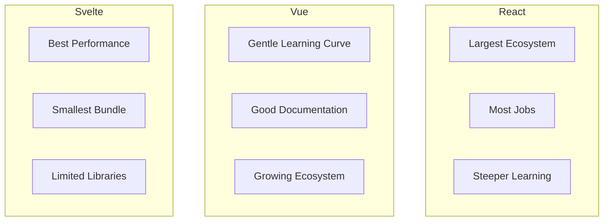
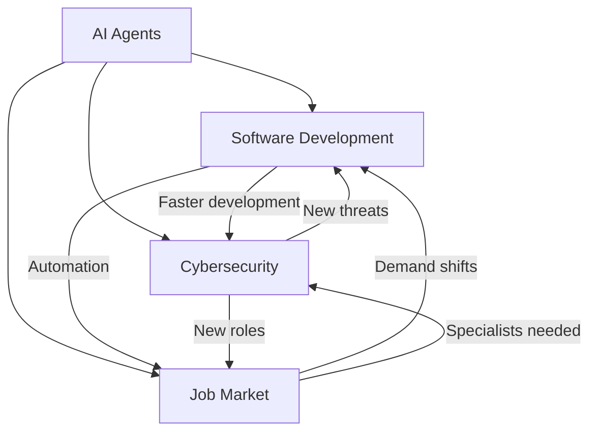

# Deep Research Examples

This document provides example queries and expected outputs to demonstrate the skill's capabilities.

---

## Example 1: Focused Query (Deep Iterative Mode)

### Input
```
"How does retrieval-augmented generation (RAG) work in modern LLM applications?"
```

### Query Analysis Output
```
**Query Type**: Focused (single technical concept)
**Research Mode**: Deep Iterative
**Filters**: Technical domain, recent implementations
```

### Research Execution
```
ITERATION 1 (Broad):
- Search: "retrieval augmented generation RAG explained 2024"
- Findings: Basic architecture, vector databases, embedding models
- Gaps: Specific implementation patterns, performance considerations

ITERATION 2 (Focused):
- Search: "RAG implementation best practices vector database"
- Search: "RAG vs fine-tuning LLM performance comparison"
- Findings: Chunking strategies, hybrid search, latency tradeoffs

ITERATION 3 (Deep):
- Search: "advanced RAG techniques reranking query expansion"
- Findings: Multi-stage retrieval, contextual compression
```

### Expected Output (Abbreviated)

```markdown
# Research Report: Retrieval-Augmented Generation (RAG)

**Date**: 2024-01-15
**Research Mode**: Deep Iterative
**Sources Analyzed**: 8 sources
**Confidence Level**: High

---

## Executive Summary

RAG combines large language models with external knowledge retrieval to provide 
accurate, up-to-date responses without retraining. The technique has become 
foundational for enterprise LLM applications, with implementations ranging from 
simple vector search to sophisticated multi-stage retrieval pipelines.

---

## Key Findings

- **Core Architecture**: RAG systems embed documents into vector space, retrieve 
  relevant chunks at query time, and inject them into LLM context [Source: url1]
- **Vector Databases**: Leading solutions include Pinecone, Weaviate, and pgvector, 
  each with tradeoffs in scale and latency [Source: url2]
- **Chunking Strategy**: Optimal chunk size typically ranges from 256-512 tokens 
  with 10-20% overlap [Source: url3]

---

## Detailed Analysis

### How RAG Works

[Detailed technical explanation with citations...]

### Implementation Patterns

[Best practices with citations...]
```

---

## Example 2: Comparative Query (Wide Parallel Mode)

### Input
```
"Compare React, Vue, and Svelte for building enterprise dashboards in 2024"
```

### Query Analysis Output
```
**Query Type**: Comparative (3-way comparison)
**Research Mode**: Wide Parallel
**Subtasks**: 
1. React for enterprise dashboards - features, ecosystem, adoption
2. Vue for enterprise dashboards - features, ecosystem, adoption
3. Svelte for enterprise dashboards - features, ecosystem, adoption
4. Cross-comparison: performance, learning curve, hiring market
```

### Research Execution
```
PARALLEL EXECUTION:
├── Search: "React enterprise dashboard development 2024 pros cons"
├── Search: "Vue.js enterprise applications dashboard 2024"
├── Search: "Svelte enterprise dashboard performance comparison"
├── Search: "React vs Vue vs Svelte performance benchmark 2024"

MERGE: Cross-reference findings, identify patterns and contradictions
```

### Expected Output (Abbreviated)

```markdown
# Research Report: Frontend Framework Comparison for Enterprise Dashboards

**Date**: 2024-01-15
**Research Mode**: Wide Parallel
**Sources Analyzed**: 12 sources
**Confidence Level**: High

---

## Executive Summary

For enterprise dashboards, React remains the safest choice due to ecosystem 
maturity and hiring pool, Vue offers the best balance of simplicity and power, 
while Svelte provides superior performance but with ecosystem limitations. 
Choice depends on team expertise and long-term maintenance considerations.

---

## Key Findings

| Framework | Strength | Weakness | Best For |
|-----------|----------|----------|----------|
| React | Ecosystem, hiring | Boilerplate | Large teams, long-term |
| Vue | Learning curve, flexibility | Smaller ecosystem | Mid-size teams |
| Svelte | Performance, bundle size | Ecosystem maturity | Performance-critical |

---

## Detailed Analysis

### React Analysis
[Detailed findings with citations...]

### Vue Analysis
[Detailed findings with citations...]

### Svelte Analysis
[Detailed findings with citations...]

### Cross-Comparison
[Performance benchmarks, developer experience, hiring considerations...]
```

### Visualization



---

## Example 3: Multi-Faceted Query (Wide Parallel Mode)

### Input
```
"What are the implications of AI agents for software development, 
cybersecurity, and the job market?"
```

### Query Analysis Output
```
**Query Type**: Multi-faceted (3 distinct domains)
**Research Mode**: Wide Parallel
**Subtasks**:
1. AI agents in software development - tools, workflows, productivity
2. AI agents and cybersecurity - threats, defenses, vulnerabilities
3. AI agents impact on developer job market - automation, new roles
4. Cross-domain implications and trends
```

### Research Execution
```
PARALLEL EXECUTION:
├── Search: "AI coding agents software development 2024 GitHub Copilot"
├── Search: "AI agents cybersecurity threats autonomous hacking"
├── Search: "AI automation software developer jobs future 2024"
├── Search: "AI agents cross-industry implications trends"

MERGE: Identify interconnections between domains
```

### Expected Output (Abbreviated)

```markdown
# Research Report: AI Agents - Software, Security, and Employment Implications

**Date**: 2024-01-15
**Research Mode**: Wide Parallel
**Sources Analyzed**: 15 sources
**Confidence Level**: Medium (rapidly evolving field)

---

## Executive Summary

AI agents are transforming software development through tools like GitHub 
Copilot and Cursor, while simultaneously creating new cybersecurity challenges 
through autonomous attack capabilities. The job market impact is nuanced—routine 
coding tasks face automation pressure, but demand for AI-augmented developers 
and AI security specialists is growing rapidly.

---

## Key Findings

- **Development**: AI coding assistants report 30-50% productivity gains for 
  routine tasks [Source: url1, url2]
- **Security**: Autonomous AI agents can now identify and exploit vulnerabilities 
  faster than human red teams [Source: url3]
- **Jobs**: Entry-level coding jobs most at risk; senior and specialized roles 
  increasingly valuable [Source: url4]
- **Intersection**: The same AI capabilities that accelerate development also 
  enable more sophisticated attacks [Source: url5]

---

## Detailed Analysis

### AI Agents in Software Development
[Detailed analysis with tools, workflows, productivity data...]

### AI Agents and Cybersecurity
[Threat landscape, defensive applications, emerging risks...]

### Job Market Implications
[Automation impact, emerging roles, skill requirements...]

### Cross-Domain Analysis
[How these three areas interact and influence each other...]
```

### Visualization



---

## Usage Notes

### Invoking the Skill

```
User: "Research [topic]"
User: "Deep dive into [topic]"
User: "Compare [A] vs [B] vs [C]"
User: "Investigate the impact of [topic] on [domain1], [domain2], and [domain3]"
```

### Requesting Specific Outputs

```
User: "Research [topic] and export as JSON"
User: "Research [topic] with visualizations"
User: "Research [topic] - focus on recent developments only"
```

### Adjusting Depth

```
User: "Quick research on [topic]" → Limits to 1-2 iterations, 5 searches
User: "Comprehensive research on [topic]" → Full 3 iterations, 10 searches
```
