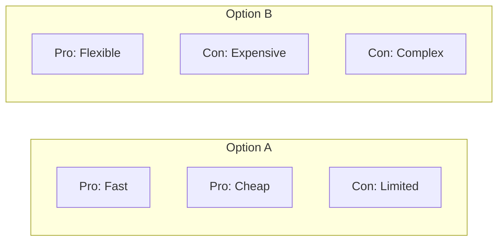
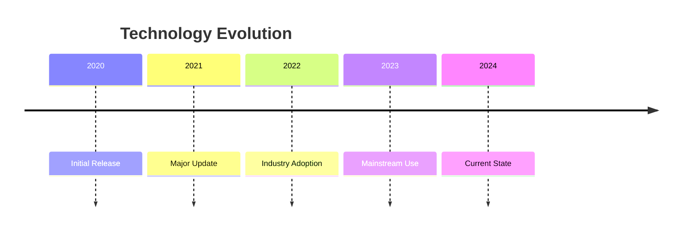
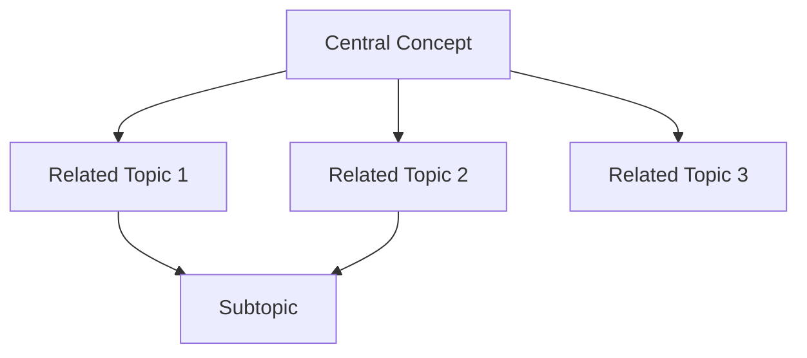
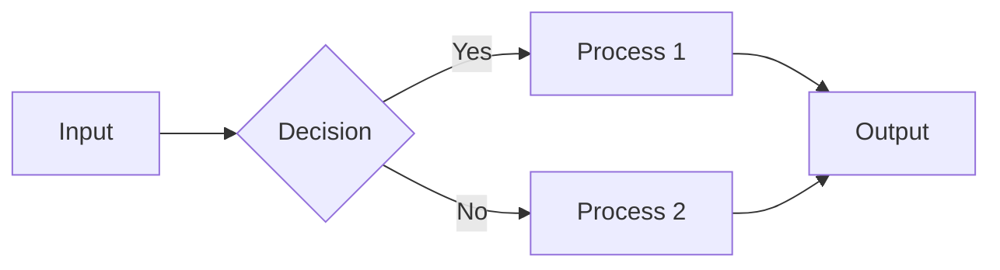

# Output Formats Reference

This document defines the templates and schemas for deep research outputs.

## Markdown Report Template

```markdown
# Research Report: [Topic]

**Date**: [YYYY-MM-DD]  
**Research Mode**: [Deep Iterative / Wide Parallel]  
**Sources Analyzed**: [N sources]  
**Confidence Level**: [High / Medium / Low]

---

## Executive Summary

[2-3 sentence overview of key findings and main takeaway]

---

## Key Findings

- **Finding 1**: [Brief statement] [Source: URL]
- **Finding 2**: [Brief statement] [Source: URL]
- **Finding 3**: [Brief statement] [Source: URL]

---

## Detailed Analysis

### [Section 1: Theme/Subtask Name]

[Detailed discussion with inline citations]

According to [Source](URL), [key point]. This finding is supported by 
[Another Source](URL), which adds [additional context].

#### Key Points
- Point A [Source: URL]
- Point B [Source: URL]

### [Section 2: Theme/Subtask Name]

[Continue pattern...]

---

## Methodology

- **Query Type**: [Focused/Comparative/Multi-faceted/Exploratory]
- **Research Mode**: [Deep Iterative/Wide Parallel]
- **Iterations/Subtasks**: [Number]
- **Total Searches**: [N of 10 max]
- **Research Date**: [Date/time for temporal context]

---

## Sources

| # | Source | Type | Quality |
|---|--------|------|---------|
| 1 | [Name](URL) | [Type] | [High/Med/Low] |
| 2 | [Name](URL) | [Type] | [High/Med/Low] |

---

## Research Gaps

- [Area where evidence was limited or conflicting]
- [Topic that warrants further investigation]

---

## Appendix (Optional)

[JSON export, additional data, extended quotes]
```

## JSON Export Schema

```json
{
  "metadata": {
    "query": "Original research query",
    "date": "2024-01-15T10:30:00Z",
    "mode": "deep_iterative | wide_parallel",
    "query_type": "focused | comparative | multi_faceted | exploratory",
    "total_searches": 7,
    "confidence": "high | medium | low"
  },
  "executive_summary": "Brief overview of findings...",
  "findings": [
    {
      "id": 1,
      "statement": "Key finding statement",
      "confidence": "high",
      "sources": ["url1", "url2"],
      "category": "theme or subtask name"
    }
  ],
  "sections": [
    {
      "title": "Section Name",
      "content": "Detailed markdown content...",
      "key_points": ["point1", "point2"],
      "sources": ["url1", "url2"]
    }
  ],
  "sources": [
    {
      "url": "https://example.com/article",
      "title": "Article Title",
      "type": "academic | news | official | blog | other",
      "quality": "high | medium | low",
      "accessed": "2024-01-15",
      "relevant_quotes": ["quote1", "quote2"]
    }
  ],
  "gaps": [
    "Description of research gap or limitation"
  ],
  "visualizations": [
    {
      "type": "comparison | timeline | relationship | hierarchy",
      "title": "Diagram title",
      "mermaid": "graph TD; A-->B;"
    }
  ]
}
```

## Mermaid Visualization Patterns

### Comparison Diagram



### Timeline Diagram



### Relationship Diagram



### Process Flow



## Citation Formats

### Inline Citation
```markdown
The technology has grown 300% year-over-year [Source: https://example.com/report].
```

### Detailed Citation
```markdown
According to [TechReport 2024](https://example.com/report), the technology 
has experienced significant growth, with adoption rates increasing by 300% 
year-over-year across enterprise segments.
```

### Conflicting Sources
```markdown
While [Source A](url) reports growth of 300%, [Source B](url) suggests 
more modest gains of 150%. This discrepancy may be due to different 
measurement methodologies or market segments analyzed.
```

## Quality Indicators

### Confidence Badges

Use at section or finding level:

```markdown
**[HIGH CONFIDENCE]** Multiple authoritative sources confirm...
**[MEDIUM CONFIDENCE]** Based on limited but credible sources...
**[LOW CONFIDENCE]** Single source or potentially biased...
**[UNVERIFIED]** Claim found but not independently verified...
```

### Source Quality Labels

| Quality | Criteria |
|---------|----------|
| High | Academic, official, or major publication; recent; corroborated |
| Medium | Established source; somewhat recent; partially corroborated |
| Low | Blog, forum, or single source; older; not corroborated |
