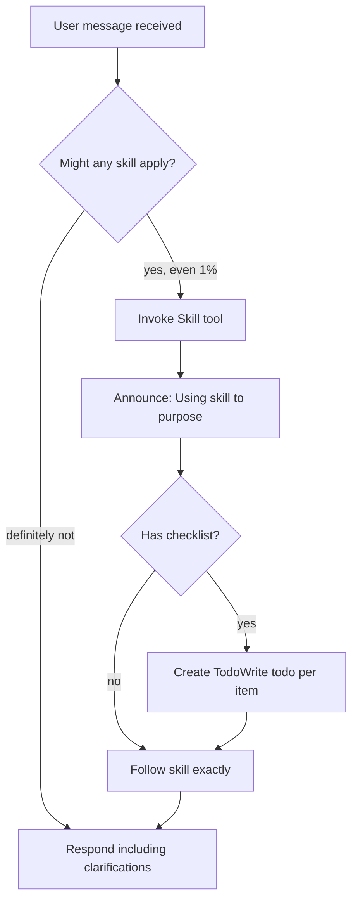

# AGENTS

<skill_checking_requirement priority="1">
<EXTREMELY_IMPORTANT>
If you think there is even a 1% chance a skill might apply to what you are doing, you ABSOLUTELY MUST read the skill.

IF A SKILL APPLIES TO YOUR TASK, YOU DO NOT HAVE A CHOICE. YOU MUST USE IT.

This is not negotiable. This is not optional. You cannot rationalize your way out of this.
</EXTREMELY_IMPORTANT>

## The Rule

**Check for skills BEFORE ANY RESPONSE.** This includes clarifying questions. Even 1% chance means invoke the Skill tool first.



## Red Flags

These thoughts mean STOP—you're rationalizing:

| Thought | Reality |
|---------|---------|
| "This is just a simple question" | Questions are tasks. Check for skills. |
| "I need more context first" | Skill check comes BEFORE clarifying questions. |
| "Let me explore the codebase first" | Skills tell you HOW to explore. Check first. |
| "I can check git/files quickly" | Files lack conversation context. Check for skills. |
| "Let me gather information first" | Skills tell you HOW to gather information. |
| "This doesn't need a formal skill" | If a skill exists, use it. |
| "I remember this skill" | Skills evolve. Read current version. |
| "This doesn't count as a task" | Action = task. Check for skills. |
| "The skill is overkill" | Simple things become complex. Use it. |
| "I'll just do this one thing first" | Check BEFORE doing anything. |
| "This feels productive" | Undisciplined action wastes time. Skills prevent this. |

## Skill Priority

When multiple skills could apply, use this order:

1. **Process skills first** (brainstorming, debugging) - these determine HOW to approach the task
2. **Implementation skills second** (frontend-design, mcp-builder) - these guide execution

"Let's build X" → brainstorming first, then implementation skills.
"Fix this bug" → debugging first, then domain-specific skills.

## Mandatory Pre-Task Checklist

Before responding to ANY user message, you MUST complete this checklist:

1. ☐ List available skills in your mind (from `<skills_system>` section below)
2. ☐ Ask yourself: "Does ANY skill match this request?"
3. ☐ If yes → Use `openskills read <skill-name>` to read and run the skill file
4. ☐ Announce which skill you're using: "I've read the [Skill Name] skill and I'm using it to [purpose]"
5. ☐ Follow the skill exactly

**Responding WITHOUT completing this checklist = automatic failure.**

## Explicit Skill Invocation

- **For Cursor/Claude:** Use `openskills read <skill-name>` command (e.g., `openskills read using-skills`)
- **The `using-skills` skill:** This skill establishes mandatory workflows for finding and using skills. If you're unsure about skill-checking protocol, invoke `using-skills` first.

## Skill Types

**Rigid** (TDD, debugging): Follow exactly. Don't adapt away discipline.

**Flexible** (patterns): Adapt principles to context.

The skill itself tells you which.

## Instructions ≠ Permission to Skip Workflows

Your human partner's specific instructions describe WHAT, not HOW. "Add X" or "Fix Y" doesn't mean skip workflows.

## Violation Examples

These are REAL examples of violations that occurred even after this requirement was added:

### Example 1: Implementing a Plan Without Skill Check
**Violation:**
```
User: "Implement the plan"
Agent: [Immediately starts reading files and making changes]
       [No mention of checking skills]
       [No openskills read command]
```

**Correct Behavior:**
```
User: "Implement the plan"
Agent: [First checks for relevant skills]
       openskills read using-skills
       openskills read plan-mode
       "I've read the using-skills and plan-mode skills and I'm using them to implement the plan correctly."
       [Then proceeds with implementation]
```

### Example 2: Starting Task Without Skill Check
**Violation:**
```
User: "Add authentication to the app"
Agent: read_file("auth.js")
       [Starts implementing immediately]
```

**Correct Behavior:**
```
User: "Add authentication to the app"
Agent: openskills read using-skills
       openskills read frontend-design  # if applicable
       "I've checked for relevant skills. Using frontend-design skill for UI components."
       [Then reads files and implements]
```

### Example 3: Rationalizing Away Skill Check
**Violation:**
```
Agent thinks: "This is just implementing a plan, I don't need to check skills"
Agent: [Proceeds without skill check]
```

**Correct Behavior:**
```
Agent thinks: "This is implementing a plan - plan-mode skill might apply"
Agent: openskills read plan-mode
       [Then proceeds]
```

### Example 4: Meta-Violation (The Problem This Solves)
**Violation:**
```
User: "I didn't use any skill. I implemented the plan directly, which violates 
      the skill-checking requirement I just added."
Agent: [Immediately starts fixing without checking skills]
```

**Correct Behavior:**
```
User: "I didn't use any skill..."
Agent: openskills read using-skills
       "I've read the using-skills skill. I understand the violation and will 
       ensure skill checks are enforced."
       [Then proceeds with enforcement implementation]
```

## Detection Patterns

The validation script (`scripts/validate_skill_checks.py`) detects violations by looking for:

1. **Task triggers without skill checks**: If user message contains words like "implement", "create", "build", "add", "fix" but agent response has no skill check evidence
2. **Tool usage without skill context**: If agent uses tools (read_file, write, etc.) in first 500 chars without mentioning skills
3. **Missing skill announcements**: If agent proceeds without "I've read the [skill] skill" or similar

## Enforcement

Multiple layers enforce this requirement:

1. **AGENTS.md instruction** (this section) - Highest priority, read first
2. **Pre-task hooks** (`.claude/hooks/pre-task-skill-check.js`) - Blocks tool execution without skill checks
3. **Validation scripts** (`scripts/validate_skill_checks.py`) - Detects violations in responses
4. **using-skills skill** - Establishes mandatory workflow

</skill_checking_requirement>

<plan_mode_instruction priority="high">
When the user requests a plan, enters "plan mode", asks "how would you approach...", or is working on a complex task (3+ distinct steps):

**STEP 0 (MANDATORY - CANNOT BE SKIPPED):**
- **BEFORE ANY OTHER ACTION**, check for relevant skills using the skill-checking requirement above
- **MUST** invoke `openskills read using-skills` if unsure about skill-checking protocol
- **MUST** check for other potentially relevant skills (plan-mode, skill-creator, etc.)
- **MUST** announce which skills you're using before proceeding
- **VIOLATION**: Starting planning without skill check = automatic failure

**Only after completing Step 0, proceed with:**

1. Invoke the `plan-mode` skill to load the planning workflow
2. Follow the structured planning phases: Understand → Research → Structure → Output
3. Ask maximum 2 clarifying questions only when critical information is missing
4. Output a Markdown plan with: Goal, Context, Approach, Steps, Assumptions, Risks, Implementation Todos (ID/task/dependencies/status)

**Common Violation:** Starting with "Let me read some files first" or "Let me understand the codebase" BEFORE checking skills. This violates Step 0.

This ensures consistent, actionable plans across Cursor, Claude, and Codex.
</plan_mode_instruction>

<plan_completion_workflow priority="high">
When a plan has been completed (all todos marked as `status: completed`), agents MUST follow this workflow:

0. **Skill Check** (BEFORE writing completion summary)
   - Check for relevant skills using the skill-checking requirement above
   - If `using-skills` or other skills apply, invoke them first
   - Even cleanup tasks should check for skills

1. **Completion Detection**
   - A plan is considered complete when ALL todos in the plan file's frontmatter have `status: completed`
   - Check plan files in `.cursor/plans/` directory for completion status
   - Parse the YAML frontmatter to read todos array and verify all statuses

2. **WorkDone.md Entry Format**
   - Location: `docs/WorkDone.md`
   - Format: Each completed plan gets a structured entry with YAML frontmatter followed by Markdown content
   - Required fields in frontmatter:
     - `plan_name`: Name from plan file frontmatter (or filename if missing)
     - `completed_at`: ISO 8601 timestamp (YYYY-MM-DDTHH:MM:SSZ)
     - `plan_file`: Relative path to the plan file (e.g., `.cursor/plans/plan_name.plan.md`)
     - `todos_count`: Total number of todos completed
     - `status`: Always "completed"
   - Content structure:
     ```markdown
     ---
     plan_name: [Plan Name]
     completed_at: [ISO timestamp]
     plan_file: [relative path]
     todos_count: [number]
     status: completed
     ---
     
     ## Plan: [Plan Name]
     
     **Completed:** [ISO timestamp]
     
     **Overview:** [Brief overview from plan frontmatter]
     
     ### Completed Todos
     [List all completed todos with their IDs and descriptions]
     
     ### Summary
     [Brief summary of what was accomplished]
     ```

3. **Writing Completion Summary**
   - Read existing `docs/WorkDone.md` content (create file if it doesn't exist)
   - Append new entry to the end of the file
   - Use atomic operation: read entire file → append new entry → write back
   - Include all completed todos with their IDs and descriptions
   - Add a brief summary of accomplishments

4. **Plan File Deletion**
   - ONLY delete the plan file AFTER successfully writing to WorkDone.md
   - Verify write operation succeeded before deletion
   - Delete plan file from `.cursor/plans/` directory
   - If write fails, do NOT delete plan file (preserve for retry)

5. **Multi-Agent Coordination**
   - When reading WorkDone.md: Read entire file first, then process
   - When writing WorkDone.md: Use atomic read-modify-write pattern
   - Include timestamps in entries to enable chronological ordering
   - If WorkDone.md is locked or in use, wait briefly and retry (max 3 attempts)
   - Never overwrite existing entries - always append
   - Format entries consistently to enable parsing by other agents

**Example WorkDone.md Entry:**
```markdown
---
plan_name: Plan File Cleanup and WorkDone Tracking
completed_at: 2025-01-15T14:30:00Z
plan_file: .cursor/plans/plan_file_cleanup_and_workdone_tracking_ea88ad91.plan.md
todos_count: 5
status: completed
---

## Plan: Plan File Cleanup and WorkDone Tracking

**Completed:** 2025-01-15T14:30:00Z

**Overview:** Update AGENTS.md to instruct agents to automatically delete plan files after completion and write structured entries to docs/WorkDone.md for multi-agent coordination.

### Completed Todos
- T1: Add `<plan_completion_workflow>` section to AGENTS.md with completion detection logic
- T2: Define WorkDone.md entry format (frontmatter + structured content)
- T3: Add instructions for writing completion summary to WorkDone.md
- T4: Add instructions for deleting plan file after successful write
- T5: Add coordination rules for multi-agent access to WorkDone.md

### Summary
Successfully added plan completion workflow instructions to AGENTS.md, defining the structured format for WorkDone.md entries, completion detection logic, and multi-agent coordination rules. The workflow ensures plan files are cleaned up after successful summary writing.
```

This ensures consistent plan cleanup and work tracking across all agents.

## Automation

The completion workflow is **automated** to prevent agents from skipping it:

1. **Post-Todo Hook** (`.claude/hooks/post-todo-completion-check.js`)
   - Automatically runs after `todo_write` operations
   - Detects when all todos in a plan are completed
   - Triggers the completion workflow automatically

2. **Workflow Executor** (`scripts/execute_plan_completion.py`)
   - Executes the completion workflow programmatically
   - Writes WorkDone.md entry atomically
   - Deletes plan file after successful write

3. **Validation** (`scripts/validate_plan_completion.py`)
   - Validates that completed plans have WorkDone.md entries
   - Detects when workflow was skipped
   - Integrated into `validate_repo.py` for standard checks

4. **Todo Sync** (`scripts/sync_plan_todos.py`)
   - Syncs todos from `todo_write` to plan file frontmatter
   - Ensures plan files have accurate todo state for detection

**How It Works:**
- When a todo is marked complete via `todo_write`, the post-todo hook checks if all todos are done
- If all todos are completed, the hook automatically calls `execute_plan_completion.py`
- The executor writes to WorkDone.md and deletes the plan file
- Validation scripts verify the workflow executed correctly

**Manual Override:**
If automation fails, agents can manually run:
```bash
python scripts/execute_plan_completion.py .cursor/plans/plan_name.plan.md
```

**Verification:**
Run validation to check for skipped workflows:
```bash
python scripts/validate_plan_completion.py
```
</plan_completion_workflow>

<web_search_policy priority="high">
No `web_search` unless the `deep-research` skill is explicitly invoked and its workflow followed.
If external sources are needed, invoke `deep-research` and perform all searches inside that workflow.
</web_search_policy>

<skills_system priority="1">

## Available Skills

<!-- SKILLS_TABLE_START -->
<usage>
When users ask you to perform tasks, check if any of the available skills below can help complete the task more effectively. Skills provide specialized capabilities and domain knowledge.

How to use skills:
- Invoke: Bash("openskills read <skill-name>")
- The skill content will load with detailed instructions on how to complete the task
- Base directory provided in output for resolving bundled resources (references/, scripts/, assets/)

Usage notes:
- Only use skills listed in <available_skills> below
- Do not invoke a skill that is already loaded in your context
- Each skill invocation is stateless
</usage>

<available_skills>

<skill>
<name>algorithmic-art</name>
<description>Creating algorithmic art using p5.js with seeded randomness and interactive parameter exploration. Use this when users request creating art using code, generative art, algorithmic art, flow fields, or particle systems. Create original algorithmic art rather than copying existing artists' work to avoid copyright violations.</description>
<location>project</location>
</skill>

<skill>
<name>brand-guidelines</name>
<description>Applies Anthropic's official brand colors and typography to any sort of artifact that may benefit from having Anthropic's look-and-feel. Use it when brand colors or style guidelines, visual formatting, or company design standards apply.</description>
<location>project</location>
</skill>

<skill>
<name>canvas-design</name>
<description>Create beautiful visual art in .png and .pdf documents using design philosophy. You should use this skill when the user asks to create a poster, piece of art, design, or other static piece. Create original visual designs, never copying existing artists' work to avoid copyright violations.</description>
<location>project</location>
</skill>

<skill>
<name>deep-research</name>
<description>Deep research skill combining Perplexity-style iterative depth with Manus-style parallel breadth. Use when users request "deep research", "research this", "investigate", or need comprehensive analysis with citations. Analyzes queries to select optimal research mode, executes multi-phase searches, and produces rich Markdown reports with inline citations, structured JSON exports, and Mermaid visualizations.</description>
<location>project</location>
</skill>

<skill>
<name>doc-coauthoring</name>
<description>Guide users through a structured workflow for co-authoring documentation. Use when user wants to write documentation, proposals, technical specs, decision docs, or similar structured content. This workflow helps users efficiently transfer context, refine content through iteration, and verify the doc works for readers. Trigger when user mentions writing docs, creating proposals, drafting specs, or similar documentation tasks.</description>
<location>project</location>
</skill>

<skill>
<name>docx</name>
<description>"Comprehensive document creation, editing, and analysis with support for tracked changes, comments, formatting preservation, and text extraction. When Claude needs to work with professional documents (.docx files) for: (1) Creating new documents, (2) Modifying or editing content, (3) Working with tracked changes, (4) Adding comments, or any other document tasks"</description>
<location>project</location>
</skill>

<skill>
<name>expo-ios-designer</name>
<description>Design iOS-first UIs for Expo/React Native apps: layout, typography, safe areas, motion, haptics, and accessibility aligned with iOS conventions.</description>
<location>project</location>
</skill>

<skill>
<name>frontend-design</name>
<description>Create distinctive, production-grade frontend interfaces with high design quality. Use this skill when the user asks to build web components, pages, artifacts, posters, or applications (examples include websites, landing pages, dashboards, React components, HTML/CSS layouts, or when styling/beautifying any web UI). Generates creative, polished code and UI design that avoids generic AI aesthetics.</description>
<location>project</location>
</skill>

<skill>
<name>internal-comms</name>
<description>A set of resources to help me write all kinds of internal communications, using the formats that my company likes to use. Claude should use this skill whenever asked to write some sort of internal communications (status reports, leadership updates, 3P updates, company newsletters, FAQs, incident reports, project updates, etc.).</description>
<location>project</location>
</skill>

<skill>
<name>mcp-builder</name>
<description>Guide for creating high-quality MCP (Model Context Protocol) servers that enable LLMs to interact with external services through well-designed tools. Use when building MCP servers to integrate external APIs or services, whether in Python (FastMCP) or Node/TypeScript (MCP SDK).</description>
<location>project</location>
</skill>

<skill>
<name>ocr</name>
<description>Extract accurate text and structured information from screenshots/images. Use when the user provides a screenshot/photo and asks to OCR, transcribe, extract tables or key/value fields, capture UI/error text, or pull specific details from an image. Prioritize fidelity; avoid hallucination; output verbatim text plus structured JSON.</description>
<location>project</location>
</skill>

<skill>
<name>pdf</name>
<description>Comprehensive PDF manipulation toolkit for extracting text and tables, creating new PDFs, merging/splitting documents, and handling forms. When Claude needs to fill in a PDF form or programmatically process, generate, or analyze PDF documents at scale.</description>
<location>project</location>
</skill>

<skill>
<name>plan-mode</name>
<description>Standardized planning workflow for Cursor, Claude, and Codex. Invoke when user requests a plan, enters "plan mode", asks "how would you approach...", or needs structured thinking before implementation. Produces Markdown plans with actionable steps, assumptions, risks, and implementation todos with IDs and dependencies.</description>
<location>project</location>
</skill>

<skill>
<name>pptx</name>
<description>"Presentation creation, editing, and analysis. When Claude needs to work with presentations (.pptx files) for: (1) Creating new presentations, (2) Modifying or editing content, (3) Working with layouts, (4) Adding comments or speaker notes, or any other presentation tasks"</description>
<location>project</location>
</skill>

<skill>
<name>shadcn-ui</name>
<description>Install and use shadcn/ui (Radix-based) components in React/Next.js/Vite projects with Tailwind, theming, and best-practice composition.</description>
<location>project</location>
</skill>

<skill>
<name>skill-creator</name>
<description>Guide for creating effective skills. This skill should be used when users want to create a new skill (or update an existing skill) that extends Claude's capabilities with specialized knowledge, workflows, or tool integrations.</description>
<location>project</location>
</skill>

<skill>
<name>slack-gif-creator</name>
<description>Knowledge and utilities for creating animated GIFs optimized for Slack. Provides constraints, validation tools, and animation concepts. Use when users request animated GIFs for Slack like "make me a GIF of X doing Y for Slack."</description>
<location>project</location>
</skill>

<skill>
<name>theme-factory</name>
<description>Toolkit for styling artifacts with a theme. These artifacts can be slides, docs, reportings, HTML landing pages, etc. There are 10 pre-set themes with colors/fonts that you can apply to any artifact that has been creating, or can generate a new theme on-the-fly.</description>
<location>project</location>
</skill>

<skill>
<name>web-artifacts-builder</name>
<description>Suite of tools for creating elaborate, multi-component claude.ai HTML artifacts using modern frontend web technologies (React, Tailwind CSS, shadcn/ui). Use for complex artifacts requiring state management, routing, or shadcn/ui components - not for simple single-file HTML/JSX artifacts.</description>
<location>project</location>
</skill>

<skill>
<name>webapp-testing</name>
<description>Toolkit for interacting with and testing local web applications using Playwright. Supports verifying frontend functionality, debugging UI behavior, capturing browser screenshots, and viewing browser logs.</description>
<location>project</location>
</skill>

<skill>
<name>xlsx</name>
<description>"Comprehensive spreadsheet creation, editing, and analysis with support for formulas, formatting, data analysis, and visualization. When Claude needs to work with spreadsheets (.xlsx, .xlsm, .csv, .tsv, etc) for: (1) Creating new spreadsheets with formulas and formatting, (2) Reading or analyzing data, (3) Modify existing spreadsheets while preserving formulas, (4) Data analysis and visualization in spreadsheets, or (5) Recalculating formulas"</description>
<location>project</location>
</skill>


<skill>


<name>Agent Development</name>


<description>This skill should be used when the user asks to "create an agent", "add an agent", "write a subagent", "agent frontmatter", "when to use description", "agent examples", "agent tools", "agent colors", "autonomous agent", or needs guidance on agent structure, system prompts, triggering conditions, or agent development best practices for Claude Code plugins.</description>


<location>project</location>


</skill>


<skill>


<name>autonomous-skill</name>


<description>Use when user wants to execute long-running tasks that require multiple sessions to complete. This skill manages task decomposition, progress tracking, and autonomous execution using Claude Code headless mode with auto-continuation. Trigger phrases: "autonomous", "long-running task", "multi-session", "自主执行", "长时任务", "autonomous skill".</description>


<location>project</location>


</skill>


<skill>


<name>ceo-advisor</name>


<description>Executive leadership guidance for strategic decision-making, organizational development, and stakeholder management. Includes strategy analyzer, financial scenario modeling, board governance frameworks, and investor relations playbooks. Use when planning strategy, preparing board presentations, managing investors, developing organizational culture, making executive decisions, or when user mentions CEO, strategic planning, board meetings, investor updates, organizational leadership, or executive strategy.</description>


<location>project</location>


</skill>


<skill>


<name>codex-cli</name>


<description>Orchestrate OpenAI Codex CLI for parallel task execution. As orchestrator, analyze tasks, inject context, manage sessions, and coordinate parallel instances. Use when delegating coding tasks to Codex or running multi-agent workflows. (user)</description>


<location>project</location>


</skill>


<skill>


<name>content-research-writer</name>


<description>Assists in writing high-quality content by conducting research, adding citations, improving hooks, iterating on outlines, and providing real-time feedback on each section. Transforms your writing process from solo effort to collaborative partnership.</description>


<location>project</location>


</skill>


<skill>


<name>data-storytelling</name>


<description>Transform data into compelling narratives using visualization, context, and persuasive structure. Use when presenting analytics to stakeholders, creating data reports, or building executive presentations.</description>


<location>project</location>


</skill>


<skill>


<name>denario</name>


<description>Multiagent AI system for scientific research assistance that automates research workflows from data analysis to publication. This skill should be used when generating research ideas from datasets, developing research methodologies, executing computational experiments, performing literature searches, or generating publication-ready papers in LaTeX format. Supports end-to-end research pipelines with customizable agent orchestration.</description>


<location>project</location>


</skill>


<skill>


<name>hive-mind-advanced</name>


<description>Advanced Hive Mind collective intelligence system for queen-led multi-agent coordination with consensus mechanisms and persistent memory</description>


<location>project</location>


</skill>


<skill>


<name>Hooks Automation</name>


<description>Automated coordination, formatting, and learning from Claude Code operations using intelligent hooks with MCP integration. Includes pre/post task hooks, session management, Git integration, memory coordination, and neural pattern training for enhanced development workflows.</description>


<location>project</location>


</skill>


<skill>


<name>prompt-engineering-patterns</name>


<description>Master advanced prompt engineering techniques to maximize LLM performance, reliability, and controllability in production. Use when optimizing prompts, improving LLM outputs, or designing production prompt templates.</description>


<location>project</location>


</skill>


<skill>


<name>pyhealth</name>


<description>Comprehensive healthcare AI toolkit for developing, testing, and deploying machine learning models with clinical data. This skill should be used when working with electronic health records (EHR), clinical prediction tasks (mortality, readmission, drug recommendation), medical coding systems (ICD, NDC, ATC), physiological signals (EEG, ECG), healthcare datasets (MIMIC-III/IV, eICU, OMOP), or implementing deep learning models for healthcare applications (RETAIN, SafeDrug, Transformer, GNN).</description>


<location>project</location>


</skill>


<skill>


<name>rag-implementation</name>


<description>Build Retrieval-Augmented Generation (RAG) systems for LLM applications with vector databases and semantic search. Use when implementing knowledge-grounded AI, building document Q&A systems, or integrating LLMs with external knowledge bases.</description>


<location>project</location>


</skill>


<skill>


<name>scientific-brainstorming</name>


<description>Research ideation partner. Generate hypotheses, explore interdisciplinary connections, challenge assumptions, develop methodologies, identify research gaps, for creative scientific problem-solving.</description>


<location>project</location>


</skill>


<skill>


<name>stream-chain</name>


<description>Stream-JSON chaining for multi-agent pipelines, data transformation, and sequential workflows</description>


<location>project</location>


</skill>


<skill>


<name>using-skills</name>


<description>Use when starting any conversation - establishes mandatory workflows for finding and using skills, including using Skill tool before announcing usage, alignment before implementation, and creating TodoWrite todos for checklists</description>


<location>project</location>


</skill>


<skill>


<name>ux-researcher-designer</name>


<description>UX research and design toolkit for Senior UX Designer/Researcher including data-driven persona generation, journey mapping, usability testing frameworks, and research synthesis. Use for user research, persona creation, journey mapping, and design validation.</description>


<location>project</location>


</skill>

</available_skills>
<!-- SKILLS_TABLE_END -->

</skills_system>

# OCR Auto-Invocation (High Priority)
- When any OCR-suitable file (per `skills/ocr/SKILL.md` extensions) is present in context, the assistant **MUST** treat the `ocr` skill as active and follow its workflow automatically, even if the user does not type `/ocr`.
- If multiple skills could apply, **prefer `ocr`** whenever the question involves anything that could plausibly be on the image/PDF (UI text, errors, tables, receipts, documents, screenshots, scans).
- The OCR behavior is a **hard requirement (MUST/ALWAYS)**, not best-effort. Defer only when the user’s intent is clearly non-content-related (e.g., delete/rename file) or they explicitly decline OCR.
- In **auto model-selection mode**, if OCR-suitable files are present, the assistant **MUST** treat the `ocr` skill as active and **MUST** follow all instructions and output format in `skills/ocr/SKILL.md` as a hard constraint, regardless of which model runs.
- When OCR runs (implicitly or explicitly), the assistant **MUST** produce exactly the two sections defined in `skills/ocr/SKILL.md` with the same headings and fenced languages (`text`, `json`); never omit the JSON section and never rename the headings.
